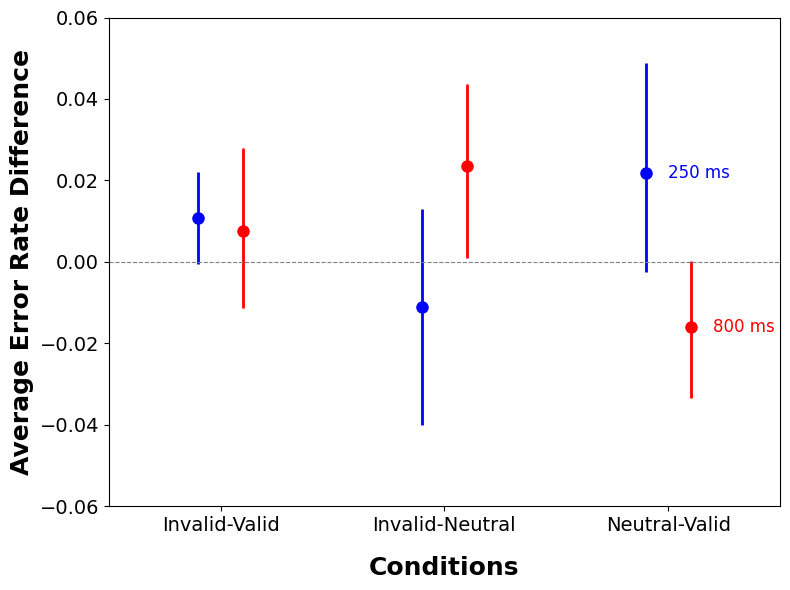

# Neuroscience Student

### Education
B.Sc. Neuroscience; Minor: Philosophy
### Coding Portfolio
The following code was used for data visualisation, the graphs for which were used in a research paper in Attention. The legendless graphs were by request. 
~~~python
import matplotlib.pyplot as plt
import numpy as np

# Data for 250 ms
conditions = ["Invalid-Valid", "Invalid-Neutral", "Neutral-Valid"]
effect_sizes_250 = [0.010860, -0.011015, 0.021875]  # RT effect sizes for 250 ms
ci_lower_250 = [-0.0004257854, -0.03999757, -0.00252237]  # Lower bounds for 250 ms confidence intervals
ci_upper_250 = [0.0221471330, 0.01312121, 0.04894255]  # Upper bounds for 250 ms confidence intervals

# Error calculations for 250 ms
ci_lower_errors_250 = [effect_sizes_250[i] - ci_lower_250[i] for i in range(len(effect_sizes_250))]
ci_upper_errors_250 = [ci_upper_250[i] - effect_sizes_250[i] for i in range(len(effect_sizes_250))]

# Data for 800 ms
effect_sizes_800 = [0.007524, 0.023564, -0.016040]  # RT effect sizes for 800 ms
ci_lower_800 = [-0.01139270, 0.0009434515, -0.0333683626]  # Lower bounds for 800 ms confidence intervals
ci_upper_800 = [0.02801684, 0.0435816707, 0.0003273794]  # Upper bounds for 800 ms confidence intervals

# Error calculations for 800 ms
ci_lower_errors_800 = [effect_sizes_800[i] - ci_lower_800[i] for i in range(len(effect_sizes_800))]
ci_upper_errors_800 = [ci_upper_800[i] - effect_sizes_800[i] for i in range(len(effect_sizes_800))]

# Create the plot
plt.figure(figsize=(8, 6))

# Define offsets for the two datasets (250 ms and 800 ms)
offset = 0.1
x_250 = np.arange(len(conditions)) - offset
x_800 = np.arange(len(conditions)) + offset

# Plot for 250 ms
plt.errorbar(x_250, effect_sizes_250, 
             yerr=[ci_lower_errors_250, ci_upper_errors_250], fmt='o', markersize=8, 
             color='blue', ecolor='blue', elinewidth=2, label='SOA 250 ms')

# Plot for 800 ms
plt.errorbar(x_800, effect_sizes_800, 
             yerr=[ci_lower_errors_800, ci_upper_errors_800], fmt='o', markersize=8, 
             color='red', ecolor='red', elinewidth=2, label='SOA 800 ms')

# Add horizontal line at 0
plt.axhline(0, color='gray', linestyle='--', linewidth=0.8)

# Aesthetics
plt.xticks(np.arange(len(conditions)), conditions, fontsize=14)  # Set x-ticks to conditions with fontsize 14
plt.yticks(fontsize=14)  # Set y-ticks fontsize to 14
plt.xlabel("Conditions", fontsize=18, fontweight='bold', labelpad=15)
plt.ylabel("Average Error Rate Difference", fontsize=18, fontweight='bold')
plt.ylim(-0.06, 0.06)  # Set y-axis limits based on error rate range
plt.xlim(-0.5, len(conditions) - 0.5)  # Set x-axis limits

plt.text(1.9 + offset, effect_sizes_250[2], '250 ms', color='blue', fontsize=12, va='center')
plt.text(2 + offset + 0.1, effect_sizes_800[2], '800 ms', color='red', fontsize=12, va='center')

# Show the plot
plt.tight_layout()
plt.show()
~~~

