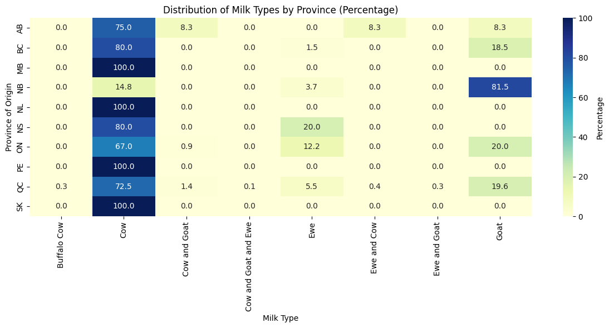

# Dalhousie Neuroscience Student

### Education
*Secondary*: 
International Baccalaureate Diploma (IB) + Provincial High School Diploma 
Governor General's Academic Medal (HS) Recipient  
*Tertiary*: 
B.Sc. Neuroscience; Minor: Philosophy 
(Ongoing at Dalhousie University (Fourth Year), GPA: 4.25) 
### Coding Portfolio
Example 1:  
The following code was used for data visualisation, the graphs for which were used in a research paper in Purely Voluntary Orienting (a subfield in attention research). The legendless graphs were by instructor request. 
~~~python
import matplotlib.pyplot as plt
import numpy as np

# Data for 250 ms
conditions = ["Invalid-Valid", "Invalid-Neutral", "Neutral-Valid"]
effect_sizes_250 = [0.010860, -0.011015, 0.021875]  # RT effect sizes for 250 ms
ci_lower_250 = [-0.0004257854, -0.03999757, -0.00252237]  # Lower bounds for 250 ms confidence intervals
ci_upper_250 = [0.0221471330, 0.01312121, 0.04894255]  # Upper bounds for 250 ms confidence intervals

# Error calculations for 250 ms
ci_lower_errors_250 = [effect_sizes_250[i] - ci_lower_250[i] for i in range(len(effect_sizes_250))]
ci_upper_errors_250 = [ci_upper_250[i] - effect_sizes_250[i] for i in range(len(effect_sizes_250))]

# Data for 800 ms
effect_sizes_800 = [0.007524, 0.023564, -0.016040]  # RT effect sizes for 800 ms
ci_lower_800 = [-0.01139270, 0.0009434515, -0.0333683626]  # Lower bounds for 800 ms confidence intervals
ci_upper_800 = [0.02801684, 0.0435816707, 0.0003273794]  # Upper bounds for 800 ms confidence intervals

# Error calculations for 800 ms
ci_lower_errors_800 = [effect_sizes_800[i] - ci_lower_800[i] for i in range(len(effect_sizes_800))]
ci_upper_errors_800 = [ci_upper_800[i] - effect_sizes_800[i] for i in range(len(effect_sizes_800))]

# Create the plot
plt.figure(figsize=(8, 6))

# Define offsets for the two datasets (250 ms and 800 ms)
offset = 0.1
x_250 = np.arange(len(conditions)) - offset
x_800 = np.arange(len(conditions)) + offset

# Plot for 250 ms
plt.errorbar(x_250, effect_sizes_250, 
             yerr=[ci_lower_errors_250, ci_upper_errors_250], fmt='o', markersize=8, 
             color='blue', ecolor='blue', elinewidth=2, label='SOA 250 ms')

# Plot for 800 ms
plt.errorbar(x_800, effect_sizes_800, 
             yerr=[ci_lower_errors_800, ci_upper_errors_800], fmt='o', markersize=8, 
             color='red', ecolor='red', elinewidth=2, label='SOA 800 ms')

# Add horizontal line at 0
plt.axhline(0, color='gray', linestyle='--', linewidth=0.8)

# Aesthetics
plt.xticks(np.arange(len(conditions)), conditions, fontsize=14)  # Set x-ticks to conditions with fontsize 14
plt.yticks(fontsize=14)  # Set y-ticks fontsize to 14
plt.xlabel("Conditions", fontsize=18, fontweight='bold', labelpad=15)
plt.ylabel("Average Error Rate Difference", fontsize=18, fontweight='bold')
plt.ylim(-0.06, 0.06)  # Set y-axis limits based on error rate range
plt.xlim(-0.5, len(conditions) - 0.5)  # Set x-axis limits

plt.text(1.9 + offset, effect_sizes_250[2], '250 ms', color='blue', fontsize=12, va='center')
plt.text(2 + offset + 0.1, effect_sizes_800[2], '800 ms', color='red', fontsize=12, va='center')

# Show the plot
plt.tight_layout()
plt.show()
~~~

Example 2:  
I created the following heatmap to aid in visualizing the distribution of various milk types used in Canadian cheeses, by province, in an effort to identify gaps in the market. This information could be useful for prospecting cheesemakers, or equally for stock farmers.
~~~python
# Heatmap for milk type concentration by province
plt.figure(figsize=(12, 6))
sns.heatmap(contingency_percent, annot=True, fmt=".1f", cmap='YlGnBu', cbar_kws={'label': 'Percentage'})
plt.title('Distribution of Milk Types by Province (Percentage)')
plt.xlabel('Milk Type')
plt.ylabel('Province of Origin')
plt.tight_layout()
plt.show()

# Stacked bar chart for visualizing the distribution of milk types by province
contingency_table.plot(kind='bar', stacked=True, figsize=(12, 6), colormap='Set2')
plt.title('Milk Type Distribution by Province')
plt.xlabel('Province')
plt.ylabel('Count')
plt.legend(title='Milk Type', bbox_to_anchor=(1.05, 1), loc='upper left')
plt.tight_layout()
plt.show()
~~~

Example 3:  
The following was created out of necessity, based on a conundrum I had regarding having to crop many images to exactly the same dimensions. It is easy to imagine how long the process would take with hundreds or thousands of images. This quickly and efficiently solves the issue. 
~~~python
from PIL import Image

# Screen resolution (of the device upon which the screenshots were taken)
screen_width = 1920  # Replace with your screen width in pixels
screen_height = 1080  # Replace with your screen height in pixels

# Dimensions of the crop box in inches
crop_width_in_inches = 5
crop_height_in_inches = 3

# DPI (Dots per Inch) of the screenshots (typically 96 DPI for most screens)
dpi = 96

# Convert dimensions to pixels
crop_width = int(crop_width_in_inches * dpi)
crop_height = int(crop_height_in_inches * dpi)

# Calculate the center of the screen
center_x = screen_width // 2
center_y = screen_height // 2

# Calculate the crop box
from PIL import Image

# Calculate the crop box
left = center_x - crop_width // 2
top = center_y - crop_height // 2 + int(0.27 * crop_height)  # Centered vertically, moved down by 1 inch, then moved up by 10% of the crop height
right = left + crop_width
bottom = top + crop_height
crop_box = (left, top, right, bottom)

# make file_paths equal to all the screenshots in the folder
file_paths = [f"Screenshot ({i}).png" for i in range(1,16)]

# Crop each image
for file_path in file_paths:
    # Open image
    img = Image.open(file_path)
    # Crop image
    cropped_img = img.crop(crop_box)
    # Save cropped image
    cropped_img.save(f"cropped_{file_path}")
~~~
Before:  
.png)
  
After:  
.png)

### Contact
- **University Email:** [lc339504@dal.ca](mailto:lc339504@dal.ca)
- **Personal Email:** [lucadoucette@gmail.com](mailto:lucadoucette@gmail.com)
- **LinkedIn:** [Visit my LinkedIn](https://www.linkedin.com/in/lucdoucette/)

